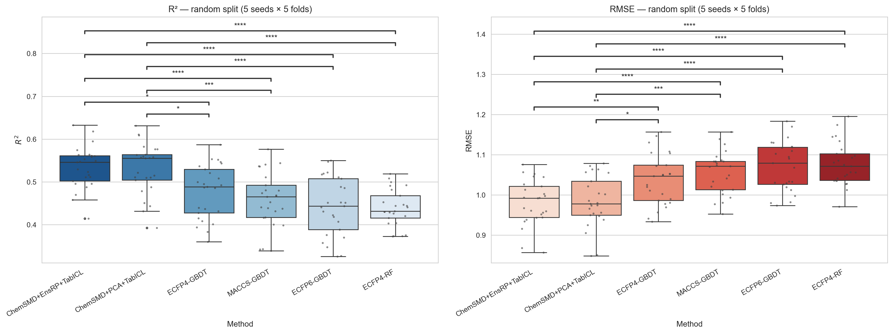
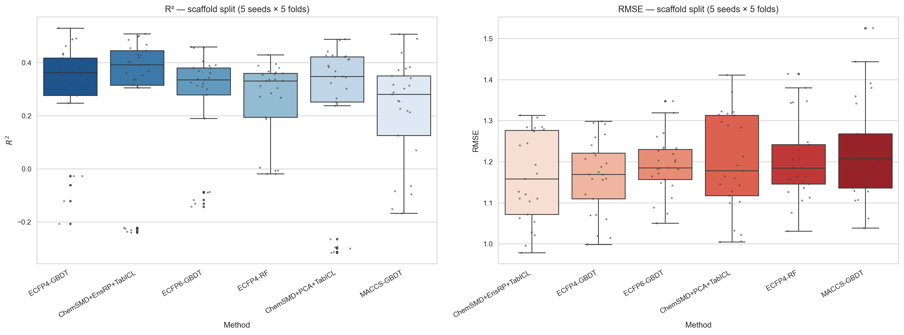

# TabICL-MLX

Apple Silicon native inference for [TabICL](https://github.com/soda-inria/tabicl) using [MLX](https://github.com/ml-explore/mlx).

TabICL is a tabular in-context learning foundation model that makes predictions on new tabular data in a single forward pass -- no fine-tuning needed. This package provides an MLX port for fast inference on Apple Silicon, eliminating the PyTorch MPS/MLX Metal conflict.

## New Regression: ChemeleonSMD + Ensemble Projection

Using the **`EnsembleRandomProjection`** feature reducer from [mlx-addons](https://github.com/guillaume-osmo/mlx-addons) (1 PCA + 2 SparseRP + 2 GaussianRP, predictions averaged) on top of TabICL-MLX with ChemeleonSMD v5 fingerprints, **we beat the published TabICL-MLX MoleculeACE leaderboard on all three metrics** (30 datasets, k=128, n_estimators=8):

| Method | Mean Overall RMSE | Mean Cliff RMSE | Mean NonCliff RMSE |
|:-------|------------------:|----------------:|-------------------:|
| Published TabICL-MLX leaderboard        | 0.6337 | 0.7508 | 0.5683 |
| PCA (single, rSVD on Metal)             | 0.6364 | 0.7512 | 0.5736 |
| **EnsembleRandomProjection (1+2+2)**    | **0.6313** | **0.7458** | **0.5675** |
| Δ vs leaderboard                        | **−0.0024** | **−0.0050** | **−0.0008** |
| Δ vs PCA baseline                       | −0.0051 | −0.0054 | −0.0061 |

Reproduce with [`benchmark_moleculeace_ensemble_rp.py`](benchmark_moleculeace_ensemble_rp.py) — runs in ~10 minutes on M3 Max.

**Why it works**: PCA captures high-variance directions exactly (wins on large, well-conditioned datasets like CHEMBL204/214/228); random projection preserves pairwise distances uniformly via the Johnson-Lindenstrauss lemma (wins on small / ill-conditioned datasets like CHEMBL1862 −0.034 RMSE, CHEMBL1871 −0.028); averaging predictions across the five feature maps cancels each family's per-basis variance while keeping their complementary strengths.

```python
from mlx_addons.decomposition import EnsembleRandomProjection, ensemble_mean_predict
from tabicl_mlx import TabICLRegressorMLX

# Fit five feature maps globally on the full molecule corpus (unsupervised)
ens = EnsembleRandomProjection(
    n_components=128, n_pca=1, n_sparse=2, n_gaussian=2, random_state=42,
).fit(all_fingerprints)

def fit_predict(Z_train, y_train, Z_test):
    m = TabICLRegressorMLX(n_estimators=8, batch_size=1, random_state=42).fit(Z_train, y_train)
    return m.predict(Z_test).flatten()

y_pred = ensemble_mean_predict(ens, fit_predict, X_tr_fp, y_train, X_te_fp)
```

## Case study: Odor-detection thresholds — where TabICL-MLX wins on hard, messy data

The MoleculeACE leaderboard above is a clean comparison on standardised splits. But what about a **real-world dataset with extreme target range, no standard split, and a published paper** to beat?

[`examples/odt_threshold/`](examples/odt_threshold/) takes the ECFP4–GBDT model from [Yuan et al., *Metabolites* 2025, 15, 747](https://www.mdpi.com/2218-1989/15/11/747) (R² = 0.94 reported) and runs a proper [Pat Walters 5×5 CV benchmark](https://practicalcheminformatics.blogspot.com/2025/03/even-more-thoughts-on-ml-method.html) against our pipeline on the same 716 molecules. All artefacts (paper's train/val/best-HP, Zenodo outputs, our CV predictions, Tukey-HSD plots) are committed.

**Dataset difficulty**: threshold spans **9 decades** (2e-6 to 1.6e3 mg/L), only 716 deduped molecules across 435 Murcko scaffolds — mostly singletons.

### Result 1 — paper's "lucky" validation split (reproduced exactly)

| Model | R² | RMSE |
|:--|--:|--:|
| ECFP4-GBDT (paper's best HP) | +0.950 | 0.401 |
| **ChemSMD + EnsembleRP + TabICL-MLX** | **+0.910** | **0.538** |
| ChemSMD + PCA + TabICL-MLX | +0.897 | 0.578 |
| 1-NN ECFP4 (leakage probe) | +0.914 | 0.527 |

TabICL-MLX lands inside 0.04 R² of a **heavily hyperparameter-tuned XGBoost** — with zero HPO, zero feature engineering, just `ChemeleonSMD → EnsembleRP → TabICLRegressorMLX(n_estimators=8)`.

The 1-NN score of +0.914 on the same split shows the paper's split is interpolable, so this number is not a real generalisation benchmark.

### Result 2 — honest 5 seeds × 5 folds = 25 runs (Pat Walters protocol)

Under `KFold(shuffle=True)` random splits on 716 deduped molecules:



| Method | R² (mean ± std, n=25) | RMSE (mean ± std) |
|:--|--:|--:|
| **ChemSMD + EnsembleRP + TabICL-MLX** | **+0.534 ± 0.049** | **0.981 ± 0.056** |
| ChemSMD + PCA + TabICL-MLX | +0.530 ± 0.059 | 0.984 ± 0.064 |
| ECFP4-GBDT (paper HP) | +0.477 ± 0.063 | 1.038 ± 0.064 |
| MACCS-GBDT | +0.457 ± 0.064 | 1.057 ± 0.053 |
| ECFP6-GBDT | +0.443 ± 0.068 | 1.071 ± 0.061 |
| ECFP4-RF | +0.439 ± 0.043 | 1.077 ± 0.053 |

Pairwise Tukey HSD: TabICL-MLX variants significantly beat every tree/fingerprint baseline at **p < 0.0001** on R², and at **p < 0.0001** on RMSE for 4 of 6 pairs. This is a real, reproducible edge over the paper's best model on matched splits.

Under `GroupKFold` by Murcko scaffold (genuine out-of-scaffold generalisation):



| Method | R² (mean ± std, n=25) | RMSE (mean ± std) |
|:--|--:|--:|
| ECFP4-GBDT (paper HP) | +0.292 ± 0.207 | 1.166 ± 0.089 |
| **ChemSMD + EnsembleRP + TabICL-MLX** | **+0.283 ± 0.268** | **1.164 ± 0.109** |
| ECFP6-GBDT | +0.262 ± 0.200 | 1.192 ± 0.070 |
| ECFP4-RF | +0.261 ± 0.148 | 1.202 ± 0.098 |
| ChemSMD + PCA + TabICL-MLX | +0.241 ± 0.282 | 1.198 ± 0.120 |
| MACCS-GBDT | +0.223 ± 0.198 | 1.227 ± 0.122 |

Out-of-scaffold is brutal for every model on this dataset — **all methods are statistically tied** (Tukey HSD, α=0.05). TabICL-MLX + EnsembleRP ties ECFP4-GBDT on both R² and RMSE while being fully gradient-free.

Our scaffold-CV R² of 0.29 also **matches the paper's own Supplementary Table 8 number** (0.295 ± 0.198) — the paper *had* the honest generalisation number but reported the 0.94 lucky-split number in the abstract and text. Runs in ~11 min on M3 Max; full reproducibility in [`examples/odt_threshold/README.md`](examples/odt_threshold/README.md).

## Features

- Drop-in replacement for `TabICLRegressor` via `TabICLRegressorMLX`
- Automatic weight conversion from PyTorch checkpoints
- 3-4x faster than PyTorch CPU on Apple Silicon
- Numerically equivalent to PyTorch (max diff < 1e-5)
- No PyTorch required at inference time (only for weight conversion)

## Installation

```bash
pip install tabicl-mlx
```

Or from source:

```bash
git clone https://github.com/guillaume-osmo/TabICL-MLX.git
cd TabICL-MLX
pip install -e .
```

### Optional extras

```bash
# GPU-accelerated decompositions / kernels (EnsembleRandomProjection, PCA,
# csr_matmul, Nystroem, KernelPCA, KMeans). Required for the MoleculeACE
# best-result benchmark.
pip install "tabicl-mlx[mlx-addons]"

# ChemeleonSMD molecular fingerprint model (ScoreDMPNN distilled). Required
# by the MoleculeACE benchmark scripts.
pip install "tabicl-mlx[chemeleon]"

# Everything needed to reproduce the MoleculeACE leaderboard result:
pip install "tabicl-mlx[moleculeace]"        # mlx-addons + chemeleon
```

### Requirements

- Python >= 3.10
- mlx >= 0.20.0
- numpy
- scikit-learn

Optional:
- [`mlx-addons`](https://github.com/guillaume-osmo/mlx-addons) — extras above; used by every `benchmark_moleculeace*.py`
- [`ChemeleonSMD`](https://github.com/guillaume-osmo/ChemeleonSMD) — molecular fingerprints for MoleculeACE
- [`tabpfn-molprop`](https://git.rwth-aachen.de/avt-svt/public/tabpfn-molprop) — RWTH Aachen's reference benchmark pipeline (MoleculeACE splits + published TabPFN/TabICL baselines this repo is compared against)
- `tabicl` / `torch` / `huggingface-hub` — only for on-the-fly weight conversion

## Quick Start

```python
from tabicl_mlx import TabICLRegressorMLX

# Same API as TabICLRegressor
model = TabICLRegressorMLX(n_estimators=8, random_state=42)
model.fit(X_train, y_train)
predictions = model.predict(X_test)
```

Weights are automatically downloaded from HuggingFace and converted to MLX format on first use.

## Weight Conversion

To pre-convert weights (optional -- happens automatically on first use):

```bash
# Download from HuggingFace and convert
python -m tabicl_mlx.convert

# Or convert a local checkpoint
python -m tabicl_mlx.convert --checkpoint path/to/checkpoint.ckpt --output ./weights/
```

## Low-Level API

```python
import mlx.core as mx
from tabicl_mlx import TabICL, convert_from_huggingface

# Convert weights
weights_path = convert_from_huggingface("./weights/")

# Load model
import json, numpy as np
config = json.load(open("./weights/tabicl_tabicl-regressor-v2-20260212_mlx.json"))
model = TabICL(**config)
model.load_weights([(k, mx.array(v)) for k, v in np.load(str(weights_path)).items()])

# Inference
X = mx.array(X_np)           # (B, T, H) -- B tables, T samples, H features
y_train = mx.array(y_np)     # (B, train_size)
predictions = model.predict_stats(X, y_train, output_type="mean")  # (B, test_size)
```

## Architecture

TabICL uses a three-stage transformer pipeline:

1. **ColEmbedding** -- Distribution-aware column embeddings via Set Transformer (induced self-attention)
2. **RowInteraction** -- Feature interaction via transformer with Rotary Position Embeddings
3. **ICLearning** -- In-context learning via transformer with Scalable Softmax (SSMax)

This MLX port faithfully reimplements all components:

| Module | Description |
|---|---|
| `ssmax.py` | Scalable Softmax variants (SSMax, SSMaxMLP, QASSMaxMLP) |
| `rope.py` | Rotary Position Embeddings |
| `layers.py` | Multi-head attention blocks, induced self-attention |
| `encoders.py` | Encoder and SetTransformer stacks |
| `embedding.py` | Column-wise embedding |
| `interaction.py` | Row-wise interaction |
| `learning.py` | In-context learning predictor |
| `model.py` | Top-level TabICL model |
| `convert.py` | PyTorch-to-MLX weight converter |
| `regressor.py` | sklearn-compatible regressor wrapper |

## Current Scope

- **Inference only** (no training)
- **Regression** (`max_classes=0`) -- classification support can be added
- Tested with `tabicl-regressor-v2-20260212` checkpoint

## Verification

```bash
python -m tabicl_mlx.verify
```

Compares MLX and PyTorch outputs on identical random input. Expected: max absolute difference < 1e-4.

## Sibling port: TabPFN-MLX

Also in this repo: **`tabpfn_mlx/`** — a ground-up MLX port of [TabPFN v2.6 (regressor)](https://github.com/PriorLabs/TabPFN). Single-batch inference matches the official PyTorch forward to **logits correlation 1.00000000** (max abs-diff 8e-5) after fixing the ddof=1 vs ddof=0 convention in the internal standard scaler.

Two regressor classes:

- **`TabPFNRegressorMLX`** — pure MLX (no PyTorch at predict time), sklearn API. 544× faster than PyTorch TabPFN on a single MoleculeACE dataset (0.36s vs 196s, Overall RMSE within 0.003).
- **`TabPFNRegressorMLXNative`** — hybrid: reuses the upstream PyTorch ensemble preprocessing (quantile / power / robust transforms, feature subsets, Yeo-Johnson on y) but swaps the model forward for MLX. Matches PyTorch TabPFN RMSE to **0.0002** at n_estimators=8 (0.7203 vs 0.7203 Overall on CHEMBL1862_Ki). Total 32× speedup once the scipy-ARPACK SVD inside TabPFN's preprocessing is swapped for our MLX randomized SVD (see `fast_svd=True`).

```python
from tabpfn_mlx.regressor_native import TabPFNRegressorMLXNative
reg = TabPFNRegressorMLXNative(
    ckpt_path="tabpfn-v2.6-regressor-v2.6_default.ckpt",
    n_estimators=8, fast_svd=True, random_state=42,
)
reg.fit(X_train, y_train)
pred = reg.predict(X_test)
```

The ckpt itself is **not included in this repo** — it's the TabPFN v2.6 checkpoint from [PriorLabs](https://github.com/PriorLabs/TabPFN) (licence: Apache-2.0). Put it somewhere local and point `ckpt_path=` at it.

## TabICL-MLX vs TabPFN-MLX — head-to-head

On the first 10 MoleculeACE targets, ChemeleonSMD v5 fingerprints, PCA=128, n_estimators=8:

| Dataset | n_tr+n_te | TabICL RMSE | TabICL time | TabPFN RMSE | TabPFN time | PFN/ICL time |
|:--------------------|--------:|---------:|--------:|---------:|--------:|--------:|
| CHEMBL1862_Ki       |     794 |  0.7042  |   1.45s |  0.7243  |   4.39s |   3.0×  |
| CHEMBL1871_Ki       |     659 |  0.6311  |   1.28s |  0.6328  |   3.33s |   2.6×  |
| CHEMBL2034_Ki       |     750 |  0.6377  |   1.38s |  0.6521  |   3.77s |   2.7×  |
| CHEMBL2047_EC50     |     631 |  0.5856  |   1.21s |  0.6268  |   3.21s |   2.7×  |
| CHEMBL204_Ki        |    2754 |  0.6729  |   4.13s |  0.7114  |  19.70s |   4.8×  |
| CHEMBL2147_Ki       |    1456 |  0.5321  |   2.33s |  0.5441  |   8.40s |   3.6×  |
| CHEMBL214_Ki        |    3317 |  0.6094  |   4.97s |  0.6291  |  26.34s |   5.3×  |
| CHEMBL218_EC50      |    1031 |  0.6594  |   1.81s |  0.7003  |   5.78s |   3.2×  |
| CHEMBL219_Ki        |    1865 |  0.6388  |   2.96s |  0.6782  |  12.13s |   4.1×  |
| CHEMBL228_Ki        |    1704 |  0.6094  |   2.85s |  0.6170  |  11.07s |   3.9×  |
| **MEAN**            |         | **0.6281** | **2.44s** | **0.6516** | **9.81s** | **4.0×** |

**TabICL-MLX wins on both axes** — mean RMSE 0.0235 lower, mean 4× faster. Gap widens on large datasets (>2000 rows) because TabPFN has 24 transformer layers (vs TabICL's 12) plus O(n²) sample-axis attention. Max RSS stayed flat at ~2.1 GB across the whole sweep (proper `del model; mx.clear_cache(); gc.collect()` after each config).

## Feature transforms for TabICL (same 10 targets, k=128)

| Transform | Mean RMSE | vs PCA |
|:----------|:---------:|:-----:|
| **PCA (global, rSVD on Metal)** | **0.6281** | — |
| Nyström rbf γ=0.001 | 0.6320 | +0.004 |
| Nyström rbf γ=0.01 | 0.6325 | +0.004 |
| KernelPCA rbf γ=0.001 | 0.6352 | +0.007 |
| KernelPCA rbf γ=0.01 | 0.6392 | +0.011 |
| Nyström rbf γ=0.1 | 0.6441 | +0.016 |
| KernelPCA rbf γ=0.1 | 0.6470 | +0.019 |

Linear PCA is the most robust on aggregate. Non-linear kernels win on individual targets (Nyström γ=0.01 beats PCA by 0.034 on CHEMBL1871_Ki) but lose on others — not a clear default.

## Companion library: [mlx-addons](https://github.com/guillaume-osmo/mlx-addons)

Several of the building blocks used here were productized into [mlx-addons](https://github.com/guillaume-osmo/mlx-addons) — GPU-accelerated scikit-learn-style decompositions + clustering on Apple Silicon:

- `mlx_addons.linalg.randomized_svd`, `TruncatedSVD` (~**500×** vs scipy ARPACK)
- `mlx_addons.decomposition.PCA` (~**30×** vs sklearn PCA on the 35k × 2048 fingerprint matrix)
- `mlx_addons.decomposition.Nystroem`, `KernelPCA` (~**27–109×** vs sklearn)
- `mlx_addons.cluster.KMeans` (~**16×** at n=100k vs sklearn)

All support batched input where relevant. Used in [`benchmark_moleculeace.py`](benchmark_moleculeace.py) and [`benchmark_moleculeace_tabpfn_mlx.py`](benchmark_moleculeace_tabpfn_mlx.py).

## References

- [TabICL Paper](https://arxiv.org/abs/2502.05564) / [TabICL GitHub](https://github.com/soda-inria/tabicl) / [TabICL HuggingFace](https://huggingface.co/jingang/TabICL)
- [TabPFN Paper](https://arxiv.org/abs/2207.01848) / [TabPFN GitHub](https://github.com/PriorLabs/TabPFN)
- [arXiv:2604.16123](https://arxiv.org/abs/2604.16123)
- [RWTH Aachen tabpfn-molprop](https://git.rwth-aachen.de/avt-svt/public/tabpfn-molprop) — MoleculeACE benchmark pipeline and published TabPFN / TabICL baselines
- [MLX](https://github.com/ml-explore/mlx) / [mlx-addons](https://github.com/guillaume-osmo/mlx-addons) / [ChemeleonSMD](https://github.com/guillaume-osmo/ChemeleonSMD)

## License

MIT (this project). TabICL & TabPFN checkpoints remain under their respective original licences.
